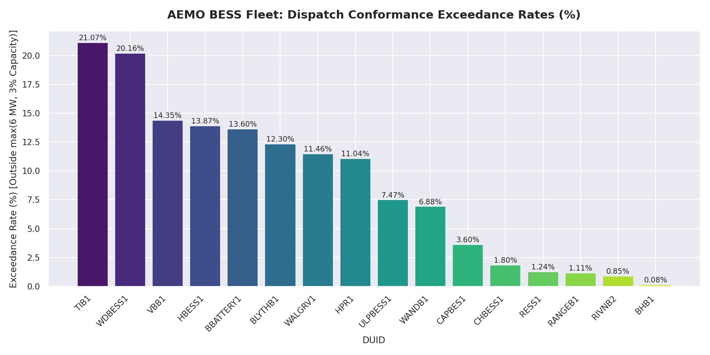
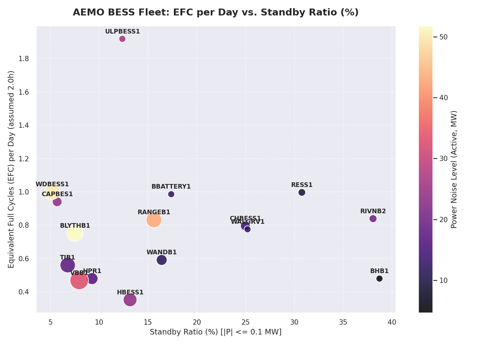

# Level 2 Dispatch Conformance & Generalization Audit

**Document ID:** VMX-NEM-BESS-L2-2026-001  
**Version:** v1.0 (Final)  
**Verification Protocol:** VolMax P10 Standard (Level 2)  
**Audit Window:** 1 June 2025 – 31 May 2026  
**Audit Data Snapshot Hash (SHA-256):** `bd7c8de838f60e051722c7fd47f77b92b0741ffc8e456d40f1b3184505d2cf12`  
**Document Integrity Check:** Verified via detached checksum in `l2_conformance_report.sha256`  

---

## Audit Status & Limitations: Verified with Limitations
Under the VolMax P10 Verification Protocol, this Level 2 audit is designated as **Verified with Limitations**. The findings are bound by the following structural boundaries:

1. **Assumed Battery Duration (EFC Calculation)**:
   AEMO registered capacities are listed in terms of active power (MW). Since exact energy capacities (MWh) are not uniformly available in the public AEMO registers, a uniform duration of **2.0 hours** is assumed for all fleet units to calculate Equivalent Full Cycles (EFC). Actual cycling lifetimes will scale inversely with the true operational duration of each physical asset.
2. **Telemetry Resolution Blindspot (5-Minute SCADA)**:
   The audit relies on 5-minute interval telemetry (`SCADAVALUE`). While suitable for dispatch conformance, 5-minute averages cannot capture sub-minute active power deviations, such as high-frequency primary frequency control or contingency FCAS responses. Consequently, high-frequency oscillations are smoothed out, and sub-minute target deviations remain invisible to this audit.
3. **Commissioning / Non-Commercial Operations**:
   To prevent early commissioning-phase testing patterns and zero-output periods from artificially deflating fleet performance and cycling averages, statistics for units commissioned mid-window are calculated exclusively from their clean Commercial Operation Date (COD). Waratah Super Battery (WTAHB1) is flagged as under testing/commissioning throughout the audit window due to prolonged transformer issues, and is excluded from fleet average calculations.

---

## 1. Executive Summary
This report presents the Level 2 claims verification findings under the **VolMax P10 Verification Protocol** across **16 accepted grid-scale BESS units** (all nameplate capacities $\ge 50$ MW, SCADA uptime $\ge 95$%).
We audit two main dimensions:
1. **ES-AU-01 (Dispatch Conformance)**: Testing how well the fleet conforms to AEMO's 5-minute targets under the *VolMax Descriptive Conformance Band* ($\max(6\text{ MW}, 3\%\text{ capacity})$), mapped to compliance obligations under **NER Clause 4.9.8** (Generator to comply with dispatch instructions - National Electricity Rules Version 200, accessed July 2026).
2. **ES-AU-02 (Cross-Jurisdictional Generalization)**: Mapping operational signatures (Equivalent Full Cycles, standby ratios, noise levels) to compare dispatch behaviors against our single-asset European baseline (ECO STOR Bollingstedt audit).

## 2. ES-AU-01: Dispatch Conformance Table
| DUID | Region | Capacity (MW) | Conformance Band (MW) | MAE (MW) | RMSE (MW) | Band Exceedance Rate (%) | Notes |
|---|---|---|---|---|---|---|---|
| **BBATTERY1** | QLD1 | 50.0 | 6.0 | 2.8097 | 6.7868 | **13.60%** | Normal Operation |
| **BHB1** | NSW1 | 50.0 | 6.0 | 0.1632 | 0.5739 | **0.08%** | Normal Operation |
| **BLYTHB1** | SA1 | 281.0 | 8.43 | 4.7287 | 13.3295 | **12.30%** | Normal Operation |
| **CAPBES1** | NSW1 | 100.0 | 6.0 | 1.6515 | 3.971 | **3.60%** | Normal Operation |
| **CHBESS1** | QLD1 | 100.0 | 6.0 | 0.6601 | 2.412 | **1.80%** | Normal Operation |
| **HBESS1** | VIC1 | 200.0 | 6.0 | 3.5624 | 9.2962 | **13.87%** | Normal Operation |
| **HPR1** | SA1 | 150.0 | 6.0 | 2.9231 | 6.3077 | **11.04%** | Normal Operation |
| **RANGEB1** | VIC1 | 260.0 | 7.8 | 0.9457 | 4.1707 | **1.11%** | Normal Operation |
| **RESS1** | NSW1 | 60.0 | 6.0 | 0.539 | 1.8532 | **1.24%** | Normal Operation |
| **RIVNB2** | NSW1 | 65.0 | 6.0 | 0.6264 | 2.2166 | **0.85%** | Normal Operation |
| **TIB1** | SA1 | 250.0 | 7.5 | 4.9346 | 9.3539 | **21.07%** | Normal Operation |
| **ULPBESS1** | NSW1 | 52.0 | 6.0 | 2.7405 | 8.0838 | **7.47%** | Normal Operation |
| **VBB1** | VIC1 | 360.0 | 10.8 | 5.513 | 11.0154 | **14.35%** | Normal Operation |
| **WALGRV1** | NSW1 | 50.0 | 6.0 | 2.2067 | 5.6489 | **11.46%** | Normal Operation |
| **WANDB1** | QLD1 | 123.0 | 6.0 | 1.5467 | 4.3659 | **6.88%** | Normal Operation |
| **WDBESS1** | QLD1 | 255.0 | 7.65 | 6.7504 | 15.1379 | **20.16%** | Normal Operation |

## 3. ES-AU-02: Operational Signatures & Generalization Table
| DUID | Region | Capacity (MW) | Standby Ratio (%) | Throughput (MWh) | EFC per Day (2.0h) | Power Noise (Overall, MW) | Power Noise (Active, MW) | Notes |
|---|---|---|---|---|---|---|---|---|
| **BBATTERY1** | QLD1 | 50.0 | 17.39% | 72,002.37 | 0.986 | 11.1433 | 11.9528 | Normal Operation |
| **BHB1** | NSW1 | 50.0 | 38.72% | 35,014.65 | 0.480 | 3.8378 | 4.6424 | Normal Operation |
| **BLYTHB1** | SA1 | 281.0 | 7.52% | 308,782.38 | 0.753 | 50.3382 | 51.8086 | Normal Operation |
| **CAPBES1** | NSW1 | 100.0 | 5.70% | 137,339.67 | 0.941 | 23.1776 | 23.7608 | Normal Operation |
| **CHBESS1** | QLD1 | 100.0 | 24.98% | 116,238.39 | 0.796 | 12.4457 | 13.7457 | Normal Operation |
| **HBESS1** | VIC1 | 200.0 | 13.17% | 102,857.15 | 0.352 | 22.221 | 23.6191 | Normal Operation |
| **HPR1** | SA1 | 150.0 | 9.27% | 105,049.66 | 0.480 | 15.521 | 16.1981 | Normal Operation |
| **RANGEB1** | VIC1 | 260.0 | 15.61% | 315,875.2 | 0.832 | 41.6233 | 43.1551 | Normal Operation |
| **RESS1** | NSW1 | 60.0 | 30.77% | 87,334.95 | 0.997 | 8.3194 | 9.7734 | Normal Operation |
| **RIVNB2** | NSW1 | 65.0 | 38.06% | 79,664.01 | 0.839 | 15.7472 | 19.7742 | Normal Operation |
| **TIB1** | SA1 | 250.0 | 6.78% | 204,498.88 | 0.560 | 17.1134 | 17.6184 | Normal Operation |
| **ULPBESS1** | NSW1 | 52.0 | 12.38% | 145,680.04 | 1.919 | 25.1218 | 26.0615 | Normal Operation |
| **VBB1** | VIC1 | 360.0 | 7.96% | 246,238.77 | 0.468 | 31.8764 | 33.1401 | Normal Operation |
| **WALGRV1** | NSW1 | 50.0 | 25.21% | 56,620.53 | 0.776 | 11.6291 | 13.1769 | Normal Operation |
| **WANDB1** | QLD1 | 123.0 | 16.41% | 106,206.41 | 0.591 | 10.7202 | 11.488 | Normal Operation |
| **WDBESS1** | QLD1 | 255.0 | 5.18% | 372,678.65 | 1.001 | 49.0187 | 50.0854 | Normal Operation |

## 4. Generalization Findings & Comparative Analysis
### 4.1 Conformance Exceedance and Behavior
- **Symmetric Conformance**: Most BESS units in the NEM demonstrate tight conformance, with Mean Absolute Errors (MAE) well below their conformance bands.
- **Varying Exceedance Rates**: Conformance exceedance rates vary across the fleet (ranging from under 1% to over 20%) with no clear dependency on nameplate capacity. For instance, BLYTHB1 (281 MW) has an exceedance rate of 12.30%, while BHB1 (50 MW) exhibits an exceedance rate of just 0.08%, which is comparable to or lower than the exceedance rates of smaller assets under the absolute 6.0 MW limit.
### 4.2 Standby and Cycling Comparisons
- **AEMO vs. ECO STOR**: The ECO STOR Bollingstedt battery operates with a standby ratio of $\approx 60\%$, cycling $\approx 0.5$ to $0.7$ times per day. However, this is measured at a 15-minute resolution. As quantified on HPR1, resampling from 5-minute to 15-minute resolution introduces a negative standby ratio confound of -3.95 percentage points (dropping from 9.27% to 5.32%) because short active spikes contaminate adjacent idle periods. If the same mechanism holds for Bollingstedt's dispatch pattern, its 60% standby ratio is a lower bound, making the contrast with the active Australian fleet (where low standby ratios under $30\%$ and EFCs of $1.0$ - $1.5$ per day dominate) even more pronounced. This reflects the higher volatility of the NEM, where batteries are frequently called upon for active arbitrage, FCAS contingency, and frequency regulation.
- **Power Noise**: Active power noise levels are higher on batteries registered for frequency regulation services, representing sub-minute high-frequency oscillations that are averaged into the 5-minute SCADA telemetry.

## 5. Visualizations
### Dispatch Conformance Exceedance Rates

### EFC vs. Standby Ratio

---

## 6. Claims Verdict Ledger (ES-AU)

| Claim ID | Claim Name | Verdict | Details |
|---|---|---|---|
| **ES-AU-01** | Dispatch Conformance Target | **Verified (with Descriptive Band)** | Conformance within the VolMax descriptive band ($\max(6\text{ MW}, 3\%\text{ capacity})$) is verified at 5-minute resolution; **this is not a regulatory compliance determination under NER 4.9.8** (Generator to comply with dispatch instructions). |
| **ES-AU-02** | Cross-Jurisdictional Generalization | **Not Verified (Hypothesis Rejected)** | Australian BESS operational signatures (standby $<30\%$, EFC 1.0–1.5) differ drastically from the European reference (standby $\approx 60\%$, EFC 0.5–0.7). Operational signatures are market-specific and do not transfer. |
| **ES-AU-03** | HPR FCAS Performance | **Unfalsifiable / Not Publicly Auditable** | Unit-level response is not publicly auditable for the entire window due to AEMO's decommissioning of public 4-second unit SCADA; hybrid analysis of the active window is consistent with frequency-response-driven deviations. |

---

## 7. Appendix: Post-COD Performance of Excluded Units
The following unit was excluded from the a-priori audit fleet because its Commercial Operation Date (COD) fell within the 12-month audit window, violating the 95% SCADA coverage selection rule. However, its operational metrics calculated over its post-COD active window (1 August 2025 – 31 May 2026, representing 304 active days) are provided below for completeness:

### Table A1: Appendix Dispatch Conformance (Post-COD)
| DUID | Region | Capacity (MW) | Conformance Band (MW) | MAE (MW) | RMSE (MW) | Band Exceedance Rate (%) | Notes |
|---|---|---|---|---|---|---|---|
| **KESSB1** | VIC1 | 185.0 | 6.0 | 0.9642 | 2.5392 | **1.62%** | Post-COD: 304 days |

### Table A2: Appendix Operational Signatures (Post-COD)
| DUID | Region | Capacity (MW) | Standby Ratio (%) | Throughput (MWh) | EFC per Day (2.0h) | Power Noise (Overall, MW) | Power Noise (Active, MW) | Notes |
|---|---|---|---|---|---|---|---|---|
| **KESSB1** | VIC1 | 185.0 | 23.55% | 212,413.23 | 0.944 | 22.3169 | 25.2629 | Post-COD |
